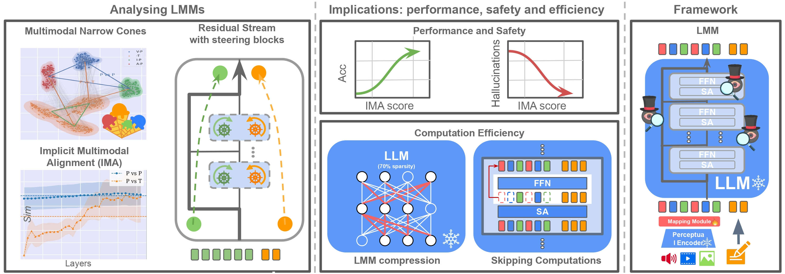

<p align="center">
    <br>
    
    <br>
<p>


<p align="center">
        &nbsp<a href="https://ima-lmms.github.io/">Project Page</a> &nbsp | &nbsp<a href="https://arxiv.org/abs/2310.">Paper </a>&nbsp 
</p>

# (IMA) Implicit Multimodal Alignment: On the Generalization of Frozen LLMs to Multimodal Inputs


<p align="center">
    <br>
    
    <br>
<p>

### Abstract

> Large Language Models (LLMs) have demonstrated impressive performance on multimodal tasks, without any multimodal finetuning. They are the de facto building block for Large Multimodal Models (LMMs), yet, we still lack a proper understanding of their success. In this work, we expose frozen LLMs to image, video, audio and text inputs and analyse their internal representation aiming to understand their generalization beyond textual inputs.

> <strong> Findings.</strong> Perceptual tokens (1) are easily distinguishable from textual ones inside LLMs, with significantly different representations (e.g. live in different narrow cones), and complete translation to textual tokens does not exist. Yet, (2) both perceptual and textual tokens activate similar LLM weights. Despite being different, (3) perceptual and textual tokens are implicitly aligned inside LLMs, we call this the implicit multimodal alignment (IMA), and argue that this is linked to architectural design, helping LLMs to generalize. This provide more evidence to believe that the generalization of LLMs to multimodal inputs is mainly due to their architecture.  

> <strong> Implications. </strong>  (1) We find a positive correlation between the implicit alignment score and the task performance, suggesting that this could act as a proxy metric for model evaluation and selection. (2) A negative correlation exists regarding hallucinations (e.g. describing non-existing objects in images), revealing that this problem is mainly due to misalignment between the internal perceptual and textual representations. (3) Perceptual tokens change slightly throughout the model, thus, we propose different approaches to skip computations (e.g. in FFN layers), and significantly reduce the inference cost. (4) Due to the slowly changing embeddings across layers, and the high overlap between textual and multimodal activated weights, we compress LLMs by keeping only 1 subnetwork (called alpha-SubNet) that works well across a wide range of multimodal tasks. The code will be available here: .


# News


* **[2024.05.27]**: The code will be released soon. 


# Citation
If you found this repository useful, you can cite it as:

```
       
```
